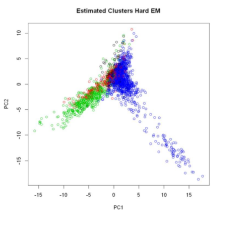
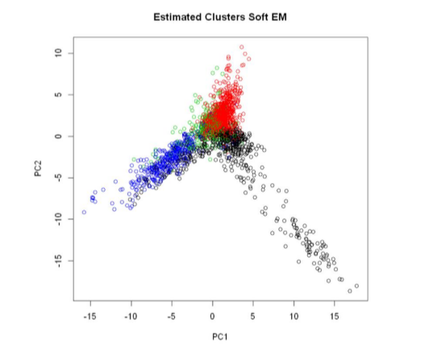
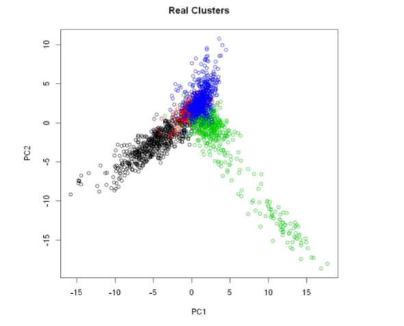

## Advance Data Analysis - Neural Network , Perceptron and Hard EM using R-programming.

1. Hard EM and Soft EM Classification:

* The probabilty calculation difference between Hard EM and Soft EM.
* Difference in normal classification and Hard , Soft classification.
* The anaysis has been performed using document clustering.

2. The importance of the Neural network over Perceptron :

* Second R notebook compares perceptron and Neural Network over different data set.
* It has been analysed perceptron performs well over the neural network when the data is linearly separable and vice-versa.

3. Different types of Neural Network explained:
    * Auto-encoder for the unsupervised learning.
    * Self taught learning with semi-super vised data.

Screenshot of the Analysis using different analysis models.

1. **Hard EM Clustering**

 

2. **Soft EM Clustering**

 

3. **Normal Clustering**

